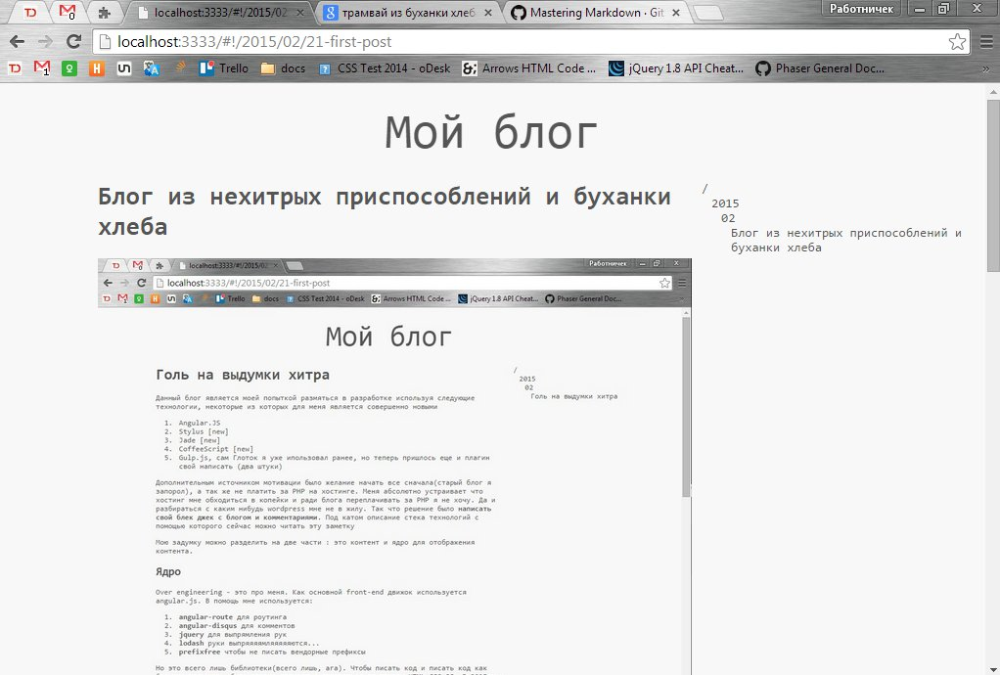
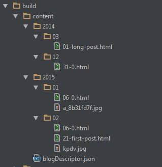

Блог из нехитрых приспособлений и буханки хлеба
===============================================



Данный блог является моей попыткой размяться в разработке используя следующие технологии, некоторые из которых для меня является
совершенно новыми
0. Angular.JS
0. Stylus [new]
0. Jade [new]
0. CoffeeScript [new]
0. Gulp.js, сам Глоток я уже ипользовал ранее, но теперь пришлось еще и плагин свой написать (два штуки)

Дополнительным источником мотивации было желание начать все сначала(старый блог я запорол), а так же не платить за PHP на
хостинге. Меня абсолютно устраивает что хостинг мне обходиться в копейки и ради блога переплачивать за PHP я не хочу.
Да и разбираться с каким нибудь wordpress мне не в жилу. Так что решение было **написать свой блек джек с
блогом и комментариями**. Под катом описание стека технологий с помощью которого сейчас можно читать эту заметку

#cut

Мою задумку можно разделить на две части : это контент и ядро для отображения контента.

Ядро
----
Over engineering - это про меня. Как основной front-end движок используется angular.js. В помощь мне используется:
0. **angular-route** для роутинга
0. **angular-disqus** для комментов
0. **jquery** для выпрямления рук
0. **lodash** руки выпряяяямляяяяяются...
0. **prefixfree** чтобы не писать вендорные префиксы


Но это всего лишь библиотеки(всего лишь, ага). Чтобы писать код и писать код как большие мальчики, было решено полностью
отказаться от триады HTML+CSS+JS. В 2015ом и писать на родных языках это моветон. Поэтому :
0. **CoffeeScript** потому что почти как python
0. **Stylus** потому что почти как python
0. **Jade** потому что почти как python

...потому что почти как python - минимальные телодвижения - максимальный выхлоп.

Правда Jade меня огорчил отсутствием include'инга из переменной, но решил я это с помощью кастомного Gulp плагина.
Потребность в этом неслучайна, так как я хотел заранее закешировать все внешние темплейты, которые используются в
angular директивах, а как выяснилось, нет ничего лучше чем просто сделать их внутреннеми, поэтому пришлось делать так
чтобы index.html изначально рендерился из jade со встроенными ```<script type='text/ng-template'>```

Никакой админки не предполагалось, задача стояла просто организовать структуру папок вроде такой :
```nohighlight
/2015
   02
      01-first-post.md
      some-image.jpg
```
Поэтому написания ядра ограничивается только созданием общей клиентской части без каких бы то ни было инструментов для
редактирования. Поддержка комментариев с помощью Disqus

Контент
-------
Для того чтобы писать посты был выбран markdown, а для конвертирования его в HTML и создания реестра постов используется
Gulp.js и кастомный рендерер(позже перепишу под кастомный плагин). Кастомные плагины и рендереры необходимы для создания
html с "правильными тегами", под таковые попадают к примеру картинки и кат. Я оборачиваю их в специальные теги sb-cut и
sb-img которые понимает ядро.

Таким образом создание постов выглядит так :
0. Создается структура папок отображающая текущий_год\текущий_месяц (если таковой не имеется)
0. Создается файл число_месяца-название.md к примеру 21-first-post.md
0. Пишется пост с использование markdown разметки
0. После написания запускается двe gulp задачи : posts и img, для конвертации постов, генерации реестра постов и копирования картинок
0. ...
0. PROFIT!!!!111

